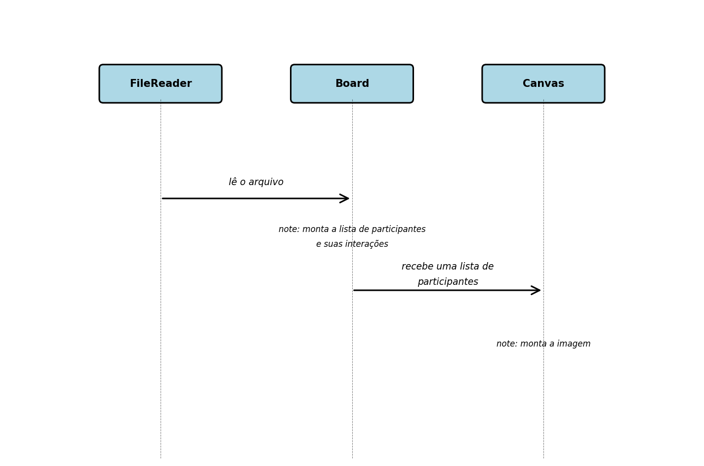

# Python UML Renderer

## How to use

Arquivo .txt (default = "example.txt")

```
participant FileReader
participant Board
participant Canvas

FileReader->Board: lê o arquivo

note over Board: monta a lista de participantes e suas interações

Board->Canvas: recebe uma lista de participantes

note over Canvas: monta a imagem
```

Código Python

```python

from uml import Board, Canvas

b = Board()

print(b.render())

c = Canvas(b.render())

c.render(output_file='output.png')

```

Resultado: 

